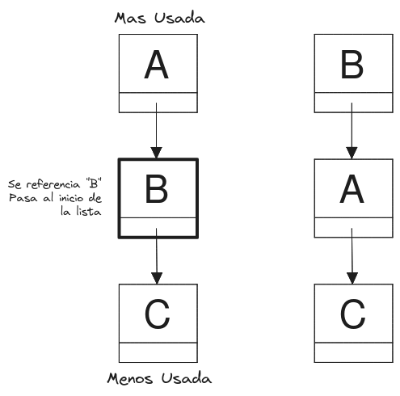
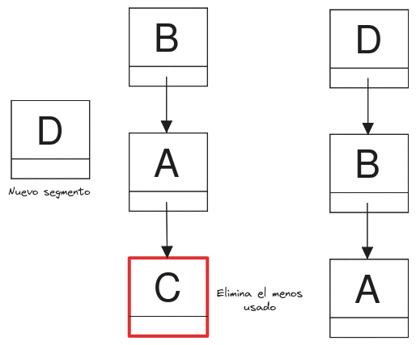
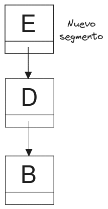
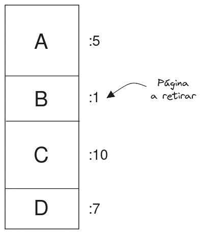
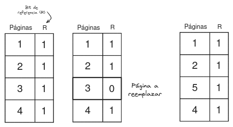

# Gestión de memoria

La gestión de memoria en sistemas operativos se refiere al **conjunto de técnicas y algoritmos** utilizados para **administrar y controlar** el uso de la memoria en un sistema informático. Esto incluye **asignar y liberar** memoria para los programas y procesos en ejecución, así como garantizar la **protección y el acceso eficiente** a la memoria por parte de los diferentes componentes del sistema operativo y las aplicaciones.

<!-- toc -->

# Ideas Previas

## Multiprogramación

Ejecución **concurrente** de múltiples procesos en una sola CPU

> **Ejecución Concurrente**
> 
> Se refiere a la propiedad de un sistema que permite que múltiples procesos se ejecuten a la vez. No significa que los procesos se estén ejecutando exactamente al mismo tiempo. En un solo procesador, la concurrencia se logra cuando el procesador cambia de un proceso a otro tan rápido que parece que todos los procesos se están ejecutando simultáneamente.

Es **la capacidad de un sistema operativo para tener varios programas o procesos en la memoria al mismo tiempo y permitir que la CPU cambie entre ellos**. En un sistema de multiprogramación, cuando un proceso se bloquea o espera la entrada/salida, la CPU puede cambiar a otro proceso que esté listo para ejecutarse, lo que aumenta la utilización de la CPU.

## Multiprocesamiento

Ejecución **simultánea** de procesos en múltiples CPUs.

> **Ejecución Simultanea**
> 
> Se refiere a la ejecución de múltiples procesos **exactamente** al mismo tiempo. Esto se logra a través de un sistema con múltiples procesadores o núcleos, donde cada proceso puede ser asignado a un procesador o núcleo diferente.

El multiprocesamiento se refiere a la capacidad de una computadora de **aprovechar la potencia de múltiples unidades de procesamiento para diferentes partes de un programa al mismo tiempo**.

El sistema operativo se encarga de gestionar la asignación de las diferentes tareas a ser realizadas por los diversos procesadores en el sistema.

## Multiusuario

El término multiusuario se refiere a la característica de ciertos sistemas operativos o programas que permiten **proveer servicio y procesamiento a múltiples usuarios** simultáneamente. Esto significa que varios usuarios pueden utilizar el mismo equipo al mismo tiempo, gracias a la capacidad de los sistemas operativos para separar los recursos del sistema.

<!-- #Solucion cual es la diferencia entre multiprocesamiento y multiprogramación -->

<!-- #Solucion entoces? la multiprogramación no significa que varios programas se ejecuten simultáneamente en la CPU. En cambio, lo que sucede es que la CPU cambia rápidamente entre los programas, ejecutando una parte de cada uno de ellos a la vez. R: SI-->

<!-- #HuntleyOpened124 -->

## Memoria Virtual

Cada proceso dispone de un espacio de memoria virtual propio donde puede almacenar sus datos.

## Memoria Real

Es el espacio físico en memoria RAM donde se almacenan los datos de todos los procesos.

## Page (Página)

Es un bloque de **memoria virtual** de tamaño fijo.

## Frame (Marco)

Es un bloque de **memoria real** de igual tamaño al de una pagina (page).

## Segmento

Similar a una página, pedo de **tamaño variable**.

# MMU

> Memory Management Unit

Traduce la dirección lógica de una memoria virtual a una dirección real en memoria real, permitiendo que cada programa tenga su propio espacio en memoria independiente a la memoria real.

 

> La MMU utiliza una estructura de datos llamada **tabla de páginas** donde se almacena la correspondencia entre la ubicación de un marco con una página.

# Requisitos para Gestionar la Memoria

- Reubicación.
- Protección.
- Compartición.
- Organización lógica.
- Organización física.

# Intercambio de Páginas (Reubicación)

> Capacidad de intercambio.

Se usa cuando hay escasez de memoria principal (RAM). Se mueven temporalmente paginas de la RAM al almacenamiento secundario (disco duro).

Un ejemplo es cuando un programa necesita acceder a una pagina que no está en memoria principal (Si se ha cambiado al almacenamiento secundario para liberar memoria), se produce un **fallo de pagina**, entonces el S.O hace un **intercambio de pagina** para cargar la memoria requerida en memoria física, actualizando la **tabla de paginas** para reflejar la nueva ubicación.

## Fragmentación Interna

> Se asigna mas memoria de la necesaria a un proceso.

## Fragmentación Externa

> La memoria se divide en bloques de tamaño variable y se generan espacios no utilizados entre bloques de memoria adyacente.

# Algoritmo de Colocación Best-fit, First-fit y Next-fit

## Best-fit.

Elije el bloque mas cercano en tamaño al bloque de memoria requerido

Ventajas: Mas eficiente en espacio de memoria.

Desventajas: Mas lento.

## First-fit.

Escanea la memoria desde el comienzo y elige el primer bloque disponible que sea lo suficientemente grande.

Ventaja: Un poco mas rápido que best-fit.

Desventaja: Puede desperdiciar mucha memoria si el espacia asignado es mas grande en comparación con la memoria alojada.

## Next-fit. 

Comienza a escanear la memoria desde la localización del último bloque de memoria alojado y elige el siguiente bloque disponible lo suficientemente grande.

Ventajas: Mas rápido que best-fit y First-fit

Desventajas: Desperdiciará los bloques de memoria que se encuentren antes del último bloque de memoria alojado.

 

## Algoritmo de Segunda Oportunidad

## Algoritmo LRU (Least Recently Used)

<!-- #JezLicenses78 -->

Algoritmo para decidir que paginas pueden ser retiradas de la memoria cuando se necesita cargar una nueva y no hay marcos disponibles, manteniendo en memoria las paginas que se han usado mas recientemente, estimando que páginas tienen mayor probabilidad de ser usadas en el futuro.

### Implementación Lista Ligada

1. Cada que se hace referencia a un dato (o página) se busca en la lista enlazada.
2. Si el dato ya está en la lista, se elimina de su ubicación actual y se agrega al principio de la lista.

 

3. Si el dato o segmento no está en la lista y la lista alcanzó su número máximo, se elimina el último elemento y se agrega el nuevo al principio de la lista.

 

4. Si el dato no está en la lista y aun no se ha alcanzado su tamaño máximo, se agrega el nuevo dato al principio de la lista.

 

### Implementación con Contador

Se requiere un contador que incremente con cada instrucción del CPU, cada que una página es referenciada, se le asigna un número actual de contador.

Cuando se necesita retirar una página de memoria, se busca la página con el número mas pequeño (la mas antigua).

 

## Algoritmo Working Set (Conjunto de trabajo)

> Algoritmo de reemplazo de páginas

### Ejemplo

Sistema con 4 marcos de página y un conjunto de trabajo de $\tau = 4$.

Secuencia: 1, 2, 3, 4, 1, 2, 5.

1. En los primeros 4 instantes de tiempo, se asignan 4 paginas a 4 marcos de página.

2. Se vuelven a referenciar las paginas 1 y 2, es hasta que se llega a la página 5 que se produce un fallo de página, en los últimos 4 instantes de tiempo solo se ha referenciado a las páginas 4, 1, 2, y 5, la única no referenciada es la 3, entonces se intercambia la pagina 3 con la pagina 5.

 

<!-- #pendiente todo lo de abajo -->

# Protección

> Los procesos solo pueden acceder a los datos autorizados.

# Compartición

# Organización Lógica

# Organización Física
