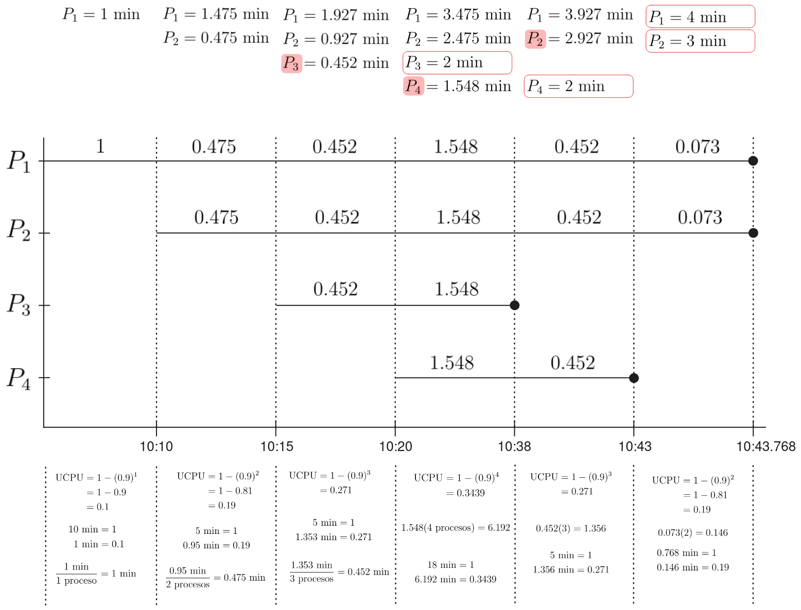

# Gestión de Memoria

Realizar la tabla de procesos y el diagrama de tiempos de los 4 procesos con $90%$ de I/O.

| Job    | Tiempo de llegada    | Minutos necesarios CPU |
|------- | -------------------- | ---------------------- |
| 1      | 10:00 min            | 4                      |
| 2      | 10:10 min            | 3                      |
| 3      | 10:15 min            | 2                      |
| 4      | 10:20 min            | 2                      |

 

- ¿Que diferencia encontró con un 90% I/O? (Con respecto a 80% I/O)
    - El orden de finalización de las tareas fue diferente respecto al de 80% I/O.
    - El tiempo empleado para terminar todas las tareas fue mucho mayor

- ¿Cual es el máximo de procesos que están al mismo tiempo y en que tiempo sucede?
    - Hay máximo 4 procesos al mismo tiempo durante 1.548 minutos

- ¿Cuál es el tiempo total que se realizan los 4 procesos?
    - 52.768 minutos

